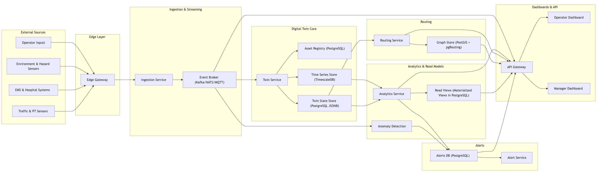

# UDT-EM Prototype

A lightweight prototype of the Urban Digital Twin for Emergency Management (UDT-EM).  
The system ingests synthetic sensor events, updates a minimal digital twin, and demonstrates the routing subsystem of the larger UDT-EM architecture.  
Everything runs in Docker.

---

## Features (Short Overview)

- Real-time synthetic sensor events  
- Lightweight ingestion and event hub  
- Prototype routing subsystem  
- Minimal twin state for routing  
- Dashboard with live updates  
- Fully containerized setup

---

## Architecture


The architecture diagram represents the full UDT-EM system, including ingestion, event streaming, the digital twin core, routing, analytics, alerts, and dashboards.

This prototype intentionally focuses on **only one subsystem** of that architecture:

#### Routing & Accessibility Service (Prototype)

- Consumes synthetic sensor events  
- Processes them through a simplified routing logic  
- Maintains a minimal in-memory or local-state twin  
- Sends results to the dashboard for visualization  

All other components shown in the diagram (Twin state stores, analytics engine, anomaly detection, alert pipeline, IAM, etc.) are **not implemented in this prototype** and only displayed to show how the routing subsystem fits into the larger UDT-EM design.

---

## Requirements

Before running anything, install:

- **Docker** and **Docker Compose**
- **Python 3.9+**
- **mqtt** and **paho-mqtt**
- Create and activate a **virtual environment**
- Install Python dependencies:

```bash
pip install -r requirements.txt
```

## How to Run

### 1. Clone the repository

```bash
git clone https://github.com/ilameya/udtem-prototype.git
```

### 2. Activate your Python environment

```bash
cd path/to/udtem-prototype/
source venv/bin/activate
```

### 3. Start the platform (Terminal 1)

```bash
docker compose build --no-cache
docker compose up
```

### 4. Start the Sensors (Terminal 2)

```bash
python load_generator.py
```

### 5. Open the Dashboard

Open the file in your browser:

```diff
index.html
```

### Notes:

- First run may take a bit because Docker pulls images and builds layers.

- If a service fails on startup, just stop everything and run docker compose up again.

- The system is intentionally simple: it’s a prototype, not your city’s future mission-critical infrastructure (yet).